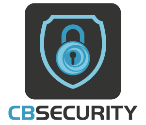
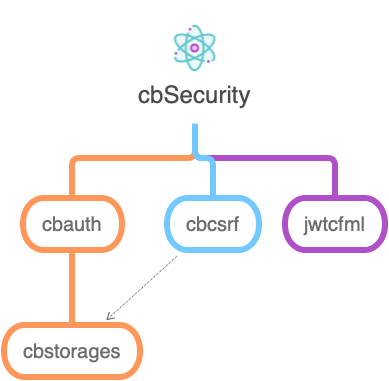

# Introduction

<figure><figcaption>
Enterprise Security for ColdBox Applications
</figcaption></figure>

**CBSecurity** is a comprehensive security framework for ColdBox applications, providing enterprise-grade authentication, authorization, and protection mechanisms. It combines multiple security modules into a cohesive, easy-to-use security platform that helps developers build secure applications with minimal effort.

<figure><figcaption>
Security Visualizer - Monitor and configure your security settings
</figcaption></figure>

## 🎯 Core Security Capabilities

CBSecurity provides a multi-layered security approach with the following key capabilities:

### 🔐 Authentication & Authorization

* **Security Firewall** - Rule-based request protection using security rules engine and handler annotations
* **Authentication Manager** (`cbauth`) - Pluggable authentication system compatible with any authentication provider
* **Basic Authentication** - Built-in HTTP Basic Auth support with credential storage and browser challenge handling
* **Authorization Service** - Functional security API for authorization checks across all application layers

### 🎫 Token Management

* **JWT Services** (`jwtcfml`) - Complete JSON Web Token implementation with generation, decoding, and validation
* **Access & Refresh Tokens** - Native support for JWT-based authentication flows
* **Token Storage** - Flexible token storage with multiple backend options

### 🛡️ Security Protections

* **CSRF Protection** (`cbcsrf`) - Cross-Site Request Forgery protection for form submissions
* **Security Headers** - Industry-standard HTTP response headers (CSP, HSTS, X-Frame-Options, XSS Protection)
* **Password Generator** - Cryptographically secure random password generation

### 📊 Management & Monitoring

* **Security Visualizer** - Graphical interface for monitoring firewall activity and managing security configurations
* **Rule Engine** - Flexible security rules supporting XML, JSON, database, and model-based configurations
* **Module Integration** - Allows modules to contribute their own security rules and validation logic

## 🧩 Module Composition

CBSecurity is built on a modular architecture that integrates several specialized security modules:

The framework leverages `cbstorages` for flexible storage backends and seamlessly integrates with the ColdBox ecosystem to provide comprehensive security coverage across your entire application.

## ⭐ Key Features

### 📋 Flexible Security Rules

* **Multiple Storage Options** - Define rules in XML, JSON, databases, or ColdBox models
* **Regular Expression Support** - Use regex patterns or simple string matching for rule definitions
* **Modular Rules** - Modules can contribute their own security rules with custom validation logic
* **Dynamic Rule Loading** - Load and unload security rules at runtime from contributing modules

### 🔒 Advanced Authorization

* **Annotation-Driven Security** - Secure handlers and actions using ColdBox annotations
* **Cascading Security** - Hierarchical security rules from global to handler to action level
* **Functional API** - Injectable security service for authorization checks in any application layer
* **Custom Validators** - Each module can define its own security validator implementation

### 🔑 Authentication Flexibility

* **Multiple Authentication Providers** - Works with `cbauth`, ColdFusion native authentication, or custom providers
* **Provider Agnostic** - Implements standard interfaces allowing any authentication system integration
* **Basic Authentication** - Built-in HTTP Basic Auth with credential storage
* **JWT Token Management** - Complete support for JWT access and refresh token workflows

### ⚡ Security Response Handling

* **Granular Control** - Distinguish between authentication failures and authorization denials
* **Customizable Actions** - Configure different responses for invalid authentication vs. authorization
* **Event-Driven** - Hook into security events for custom logging, monitoring, or response handling

## 📜 License

CBSecurity is open-source software licensed under the [Apache License 2.0](http://www.apache.org/licenses/LICENSE-2.0).

## 📚 Resources

### 📖 Documentation & Support

* **Documentation** - [https://coldbox-security.ortusbooks.com](https://coldbox-security.ortusbooks.com)
* **Source Code** - [https://github.com/coldbox-modules/cbsecurity](https://github.com/coldbox-modules/cbsecurity)
* **Issue Tracker** - [https://github.com/coldbox-modules/cbsecurity/issues](https://github.com/coldbox-modules/cbsecurity/issues)
* **Community Forum** - [https://community.ortussolutions.com/c/box-modules/cbsecurity/](https://community.ortussolutions.com/c/box-modules/cbsecurity/26)

### 💬 Getting Help

The ColdBox community is active and ready to help:

* **Community Forum** - Ask questions and share knowledge with other developers
* **GitHub Issues** - Report bugs and request features
* **Professional Support** - Enterprise support available through Ortus Solutions

## 🏢 Professional Open Source

CBSecurity is professionally developed and supported by [Ortus Solutions, Corp](http://www.ortussolutions.com/services), a leader in CFML consulting and development.

### 🚀 Enterprise Services

Ortus Solutions offers comprehensive professional services for CBSecurity and the ColdBox Platform:

* **🛠️ Custom Development** - Tailored security solutions for your specific requirements
* **👨‍🏫 Professional Support & Mentoring** - Expert guidance from the creators of ColdBox
* **📚 Training** - Official ColdBox and security training programs
* **🔍 Architecture & Code Reviews** - Expert evaluation of your security implementation
* **⚡ Performance Optimization** - Server tuning and application optimization
* **🔐 Security Hardening** - Comprehensive security audits and hardening services

[Learn more about our services](http://www.ortussolutions.com/services)

***

## 🙏 HONOR GOES TO GOD ABOVE ALL

Because of His grace, this project exists. If you don't like this, then don't read it; it's not for you.

> "Therefore being justified by **faith**, we have peace with God through our Lord Jesus Christ: By whom also we have access by **faith** into this **grace** wherein we stand, and rejoice in hope of the glory of God." Romans 5:5
