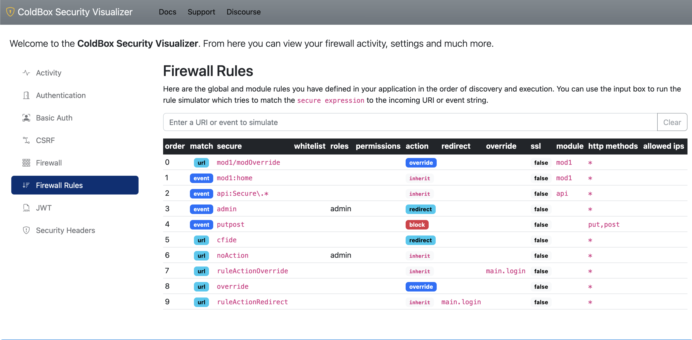

# Overview

## Authentication/Authorization

For any security system, you need to know **who** is authenticated (authentication) and **what** (authorization) this user is allowed to do. `cbsecurity` is no different, so it provides an:

* **Authentication system** which performs the following functions:
  * Validates user credentials
  * Logs them in and out
  * Tracks their security in sessions or any custom storage
* **Authorization** system which:
  * Validates permissions or roles or both or none at all :smile:

 (1).png>)

## CBSecurity Security Firewall

With CBSecurity, you can **secure** all your incoming ColdBox events from execution through security rules or discrete annotations within your handler's code. You will also be able to leverage our `CBSecurity` service model to secure any code context anywhere, from execution blocks to views and much more.

 (1).png>)

The module wraps itself around the `preProcess` interception point (The first execution of a ColdBox request) will try to validate if the request has been authenticated and authorized to execute. &#x20;

### Validators

<figure><figcaption><p>Security Validators Process Flow</p></figcaption></figure>

This is done via security rules and/or annotations on the requested handler actions and through a CBSecurity `Validator` which knows how to authenticate and authorize the request.  CBSecurity ships with many validators:

* **Auth Validator**: this is the default validator, which provides authentication and _permission-_based security through our `IAuthService` and `IAuthUser` interfaces.
* **CFML Security Validator:** ColdBox security has had this validator since version 1,  and it will talk to the ColdFusion engine's security methods (`cflogin,cflogout`). It provides authentication and _role-based_ security.
* **Basic Auth Validator:** This validator secures your app via [basic authentication](https://developer.mozilla.org/en-US/docs/Web/HTTP/Authentication) browser challenges to incoming requests. It can also work with the `BasicAuthUserService` and provide you a basic user credentials storage within your configuration file.&#x20;
* **JWT Validator**: If you want to use JSON Web Tokens, the JWT Validator provides authorization and authentication by validating incoming access/refresh tokens via headers for RESTFul API communications.
* **Custom Validator:** You can define your own authentication and authorization engines and plug them into the cbsecurity framework.

### How Does Validation Happen?

How does the interceptor know a user doesn't or does have access? Well, here is where you register a Validator CFC (`validator` setting) with the interceptor that implements two validation functions: `ruleValidator()` and `annotationValidator()` that will allow the module to know if the user is logged in and has the right authorizations to continue with the execution.


You can find an interface for these methods in `cbsecurity.interfaces.ISecurityValidator`


The validator has two options to determine if the user will be allowed access:

* The `ruleValidator`() function will evaluate configured [security rules](../usage/untitled-1.md)
* The  `annotationValidator()` function will look at [security annotations](../usage/security-annotations.md) in your handler and handler actions.

You can use rules, annotations, or even both. Rules are much more flexible and can be visualized in our security visualizer.  Also, note that rules will be evaluated before annotations.

The validators' job is to tell back to the firewall if they are allowed access and if they don't, what type of validation they broke: **authentication** or **authorization**.  It can also determine if the firewall should block the request.

> `Authentication` is when a user is NOT logged in
>
> `Authorization` is when a user does not have the right permissions to access an event/handler or action.


In some special cases, the validator can also challenge the user to log in like our `BasicAuthValidator` which sends a unique HTTP Header to prompt the user for credentials.


## Validation Process

Once the firewall has the results and the user is **NOT** allowed access, the following will occur:

* The request that was blocked will be logged via LogBox with the offending IP and extra metadata
* If firewall database logging is turned on, we will log the block in our database logs so the visualizer can represent them.
* The current requested URL will be flashed into ColdBox Flash as `_securedURL` so it can be used in relocations
* If using a rule, the rule will be stored in `prc` as `cbsecurity_matchedRule`
* The validator results will be stored in `prc` as `cbsecurity_validatorResults`
* If the type of invalidation is `authentication` the `cbSecurity_onInvalidAuthentication` interception will be announced
* If the type of invalidation is `authorization` the `cbSecurity_onInvalidAuthorization` interception will be announced
* If the type is `authentication` the default action (`defaultAuthenticationAction`) for that type will be executed (An override or a relocation or a firewall block).
* If the type is `authorization` the default action (`defaultAuthorizationAction`) for that type will be executed (An override or a relocation or a firewall block).

## Security Rules vs. Annotation Security

Here are the basics of a security rule which can be defined in JSON, XML, database or CFML.  Please note that only the following keys are mandatory:

* `securelist`


```javascript
firewall : {
  rules : [
    {
        // A list of white list events or Uri's patterns
        "whiteList": "",
        // A list of secured list events or Uri's patterns
        "secureList": "",
        // Are we matching a ColdBox event or the URL: event|url
        "match": "event",
        // Which authorization roles a user must have in order to access the secure list
        "roles": "admin",
        // Which authorization permsissions a user must have in order to access the secure list
        "permissions": "",
        // What happens if the user is not authenticated or authorized
        // redirect or override or block
        "action" : "redirect",
        // If rule breaks, and you have a redirect it will redirect here, else use the global setting
        "redirect"      : "",
        // If rule breaks, and you have an event, it will override it, else use the global setting
	"overrideEvent" : "",
	// Force SSL if using a redirect
        "useSSL": false,
        // Which http methods are allowed to execute the incoming event/url
        "httpMethods" : "*",
        // Which IP Addresses are allowed to execute the incoming event/url
        "allowedIPs" : "*"
    }
  ]
}
```



```javascript
// Secure the entire handler
component secured{

	function index(event,rc,prc){}
	function list(event,rc,prc){}

}
// Same as this
component secured=true{
}

// Do NOT secure the handler
component secured=false{
}
// Same as this, no annotation!
component{

	function index(event,rc,prc) secured{
	}

	function list(event,rc,prc) secured="list"{

	}
	 
```


Your application can be secured with security rules or handler and method annotations. Before making your choice, you should take the following arguments into consideration:

* Annotations are directly visible in your code but are very static.&#x20;
* Annotations can protect events. Rules can protect events and incoming URLs.
* Rules allow you to change your actions (override, redirect, or block) and target each rule. With annotations, you can only use your configured default action and target.
* When stored in a file or database, rules can be edited by admins at runtime.

### Security Rules

Global Rules can be declared in your `config/ColdBox.cfc` in plain CFML or in any module's `ModuleConfig.cfc` or they can come from the following global sources:

* A JSON file
* An XML file
* The database by adding the configuration settings for it
* A model by executing a `getSecurityRules()` method from it or any method of your choice

#### Rule Anatomy

A rule is a struct that can be composed of the following elements. All of them are optional except the `secureList`.

```javascript
firewall : {
  rules : [
    {
        // A list of white list events or Uri's patterns
        "whiteList": "",
        // A list of secured list events or Uri's patterns
        "secureList": "",
        // Are we matching a ColdBox event or the URL: event|url
        "match": "event",
        // Which authorization roles a user must have in order to access the secure list
        "roles": "admin",
        // Which authorization permsissions a user must have in order to access the secure list
        "permissions": "",
        // What happens if the user is not authenticated or authorized
        // redirect or override or block
        "action" : "redirect",
        // If rule breaks, and you have a redirect it will redirect here, else use the global setting
        "redirect"      : "",
        // If rule breaks, and you have an event, it will override it, else use the global setting
	"overrideEvent" : "",
	// Force SSL if using a redirect
        "useSSL": false,
        // Which http methods are allowed to execute the incoming event/url
        "httpMethods" : "*",
        // Which IP Addresses are allowed to execute the incoming event/url
        "allowedIPs" : "*"
    }
  ]
}
```

#### Global Rules

Rules can be declared globally in your `config/ColdBox.cfc` or they can also be placed in any custom module in your application.  Here is the shorthand approach to defining rules:


```javascript
// CB Security
cbSecurity : {
    firewall : {
        // Auto load the global security firewall automatically, else you can load it a-la-carte via the `Security` interceptor
	"autoLoadFirewall"            : true,
	// The Global validator is an object that will validate the firewall rules and annotations and provide feedback on either authentication or authorization issues.
	"validator"                   : "CBAuthValidator@cbsecurity",
	// Activate handler/action based annotation security
	"handlerAnnotationSecurity"   : true,
	// The global invalid authentication event or URI or URL to go if an invalid authentication occurs
	"invalidAuthenticationEvent"  : "security.login",
	// Default Auhtentication Action: override or redirect when a user has not logged in
	"defaultAuthenticationAction" : "redirect",
	// The global invalid authorization event or URI or URL to go if an invalid authorization occurs
	"invalidAuthorizationEvent"   : "security.notAuthorized",
	// Default Authorization Action: override or redirect when a user does not have enough permissions to access something
	"defaultAuthorizationAction"  : "redirect",
        // Firewall database event logs.
	"logs" : {
		"enabled"    : true,
		"table"      : "cbsecurity_logs",
		"autoCreate" : true
	},
	// The global security rules defined inline 
        "rules" : [
            {
                "securelist": "^admin",
                "match": "event",
                "roles": "admin",
                "action" : "redirect"
            },
            {
                "securelist": "^noAction",
                "match": "url",
                "roles": "admin"
            },
            {
                "securelist": "ruleActionOverride",
                "match": "url",
                "action" : "override",
                "overrideEvent": "main.login"
            },
            {
                "securelist": "override",
                "match": "url",
                "overrideEvent" : "security.login"
            },
            {
                "securelist": "ruleActionRedirect",
                "match": "url",
                "redirect": "main.login"
            }
        ]
    }
};
```


As you can see, you can combine all the security rule keys as you see fit.  Here is the same config, but the rules will come from a JSON file:

```javascript
// CB Security
cbSecurity : {
    firewall : {
        / Auto load the global security firewall automatically, else you can load it a-la-carte via the `Security` interceptor
	"autoLoadFirewall"            : true,
	// The Global validator is an object that will validate the firewall rules and annotations and provide feedback on either authentication or authorization issues.
	"validator"                   : "CBAuthValidator@cbsecurity",
	// Activate handler/action based annotation security
	"handlerAnnotationSecurity"   : true,
	// The global invalid authentication event or URI or URL to go if an invalid authentication occurs
	"invalidAuthenticationEvent"  : "security.login",
	// Default Auhtentication Action: override or redirect when a user has not logged in
	"defaultAuthenticationAction" : "redirect",
	// The global invalid authorization event or URI or URL to go if an invalid authorization occurs
	"invalidAuthorizationEvent"   : "security.notAuthorized",
	// Default Authorization Action: override or redirect when a user does not have enough permissions to access something
	"defaultAuthorizationAction"  : "redirect",
        // Firewall database event logs.
	"logs" : {
		"enabled"    : true,
		"table"      : "cbsecurity_logs",
		"autoCreate" : true
	},
        "rules" : {
        	"useRegex" : true,
        	"defaults" :{ name : "" },
        	"provider" : {
        	  "source" : "config/security-rules.json.cfm"
        	}
        }
    }
};
```

### Annotation Security

The firewall will inspect handlers for the `secured` annotation. This annotation can be added to the entire handler or to an action, or both. The default value of the `secured` annotation is a Boolean `true`. This means we need a user to be authenticated in order to access it.


```javascript
// Secure this handler
component secured{

    function index(event,rc,prc){}
    function list(event,rc,prc){}

}

// Same as this
component secured=true{
}

// Not the same as this
component secured=false{
}
// Or this
component{

    function index(event,rc,prc) secured{

    }

    function list(event,rc,prc) secured="list"{

    }

}
```


#### Authorization Context

You can also give the annotation a value, which can be anything you like: A list of roles, a role, a list of permissions, metadata, etc. Whatever it is, this is the **authorization context,** and the user **validator** must be able to authenticate but authorize the context, or an invalid authorization will occur. **Ultimately it's up to the Validator to decide what that value does and means.**


```javascript
// Secure this handler
component secured="admin,users"{

    function index(event,rc,prc) secured="list"{

    }

    function save(event,rc,prc) secured="write"{

    }

}
```


#### Cascading Security

By having the ability to annotate the **handler** and also the **action,** you create a cascading security model where they need to be able to access the handler first, and only then will the action be evaluated for access as well.

## Security Validators

As we mentioned at the beginning of this overview, the security module will use a **Validator** object to determine if the user has authentication/authorization or not. This setting is the `validator` setting and will point to the WireBox ID that implements the following methods: `ruleValidator() and annotationValidator().`  The validator can also be selected on a per module basis as well.


```javascript
/**
 * Copyright since 2016 by Ortus Solutions, Corp
 * www.ortussolutions.com
 * ---
 * All security validators must implement the following methods
 */
interface{

	/**
	 * This function is called once an incoming event matches a security rule.
	 * You will receive the security rule that matched and an instance of the ColdBox controller.
	 *
	 * You must return a struct with three keys:
	 * - allow:boolean True, user can continue access, false, invalid access actions will ensue
	 * - type:string(authentication|authorization) The type of block that ocurred.  Either an authentication or an authorization issue
	 * - messages:string Info/debug messages
	 *
	 * @return { allow:boolean, type:string(authentication|authorization), messages:string }
	 */
	struct function ruleValidator( required rule, required controller );

	/**
	 * This function is called once access to a handler/action is detected.
	 * You will receive the secured annotation value and an instance of the ColdBox Controller
	 *
	 * You must return a struct with three keys:
	 * - allow:boolean True, user can continue access, false, invalid access actions will ensue
	 * - type:string(authentication|authorization) The type of block that ocurred.  Either an authentication or an authorization issue
	 * - messages:string Info/debug messages
	 *
	 * @return { allow:boolean, type:string(authentication|authorization), messages:string }
	 */
	struct function annotationValidator( required securedValue, required controller );

}

```


Each validator must return a `struct` with the following keys:

* `allow:boolean` A Boolean indicator if authentication or authorization was violated and we should block or not.  `True = allow, false = block`
* `type:stringOf(authentication|authorization)` A string that indicates the type of violation: authentication or authorization.
* `messages:string` Info or debugging messages

### AuthValidator

ColdBox security ships with the `AuthValidator@cbsecurity` which is the default validator in the configuration setting `validator`.  This validator can talk to ANY authentication service as long as it implements our `IAuthService` interface.  The typical methods it calls on your authentication service are:

* `isLoggedIn()`
* `getUser()`

It will then also talk to the User object returned from `getUser()` which must implement the `IAuthUser` interface.  The typical methods called on your User object are:

* `hasRole()`
* `hasPermission()`

These methods are used in order to determine authorizations.

```javascript
cbsecurity = {
    validator = "AuthValidator@cbsecurity"
}
```


The `AuthValidator` will talk to the configured authentication service to validate authentication and authorization.


<pre class="language-javascript"><code class="lang-javascript">  cbAuth: {
    userServiceClass: "UserService"
<strong>  }
</strong></code></pre>

### BasicAuthValidator

This validator also ships with CBSecurity which will challenge users with browser-based basic authentication.  When used, it will use whatever authentication system and user service you have configured.  If you don't change the default settings, then CBSecurity will switch to using the `BasicAuthUserService` which allows you to store user credentials in your configuration file.  Let's see how to do that:

```javascript
cbsecurity = {
    firewall : {
        validator : "BasicAuthValidator@cbsecurity",
        invalidAuthenticationEvent : "security.invalid",
        invalidAuthorizationEvent : "security.notAuthorized",
        rules = [
            {
                secureList : "^admin"
            }
         ] 
    },
    basicAuth : {
        users : {
            "lmajano" : { password : "test" }
        }
    }
}
```

With this configuration, the basic auth validator will allow users to log in via the browser's basic authentication.  What about logging out then? Well, you have two options:

1. Close your browser, which clears the session
2. We ship with an endpoint to call for securely logging out: `/cbsecurity/basicauth/logout`

### Custom Validators

The second method of authentication is based on your custom security logic. You will be able to register a validation object with the module. Once a rule is matched, the module will call your validation object, send in the rule/annotation value and ask if the user can access it or not. It will be up to your logic to determine if the rule is satisfied or not. Below is a sample permission-based security validator:


```javascript
component singleton{

    struct function ruleValidator( required rule, required controller ){
        return permissionValidator( rule.permissions, controller, rule );
    }

    struct function annotationValidator( required securedValue, required controller ){
        return permissionValidator( securedValue, controller );
    }

    private function permissionValidator( permissions, controller, rule ){
        var results = { "allow" : false, "type" : "authentication" };
        var user     = getCurrentUser();

        // First check if user has been authenticated.
        if( user.isLoaded() AND user.isLoggedIn() ){
            // Do we have the right permissions
            if( len( arguments.permissions ) ){
                results.allow     = user.checkPermission( arguments.permission );
                results.type     = "authorization";
            } else {
                results.allow = true;
            }
        }

        return results;
    }
}
```


## Authentication vs Authorization

The security module can distinguish between authentication issues and authorization issues. Once these actions are identified, the security module can act upon the result of these actions. These actions are based on the following 4 settings, but they all come down to three outcomes:

* Relocation to another event or URL
* An event override
* A firewall 401 Not Authorized block

| Setting                       | Default      | Description                                                                                                         |
| ----------------------------- | ------------ | ------------------------------------------------------------------------------------------------------------------- |
| `invalidAuthenticationEvent`  | ---          | The global invalid authentication event or URI or URL to go if an invalid authentication occurs                     |
| `defaultAuthenticationAction` | **redirect** | Default Authentication Action: override or redirect when a user has not logged in                                   |
| `invalidAuthorizationEvent`   | ---          | The global invalid authorization event or URI or URL to go if an invalid authorization occurs                       |
| `defaultAuthorizationAction`  | **redirect** | Default Authorization Action: override or redirect when a user does not have enough permissions to access something |

## Interceptions

### Authentication / Authorization

When invalid authentication or authorizations occur the interceptor will announce the following events:

* `cbSecurity_onInvalidAuthentication`
* `cbSecurity_onInvalidAuthorization`

You will receive the following data in the `interceptData` struct:

* `ip` : The offending IP address
* `rule` : The security rule intercepted or empty if annotations
* `settings` : The firewall settings
* `validatorResults` : The validator results
* `annotationType` : The annotation type intercepted, `handler` or `action` or empty if rule driven
* `processActions` : A Boolean indicator that defaults to **true**. If you change this to **false**, then the interceptor won't fire the invalid actions. Usually, this means, you manually will do them.

### Firewall Blocks

* `cbSecurity_onFirewallBlock` - When the firewall blocks an incoming request with a 403

You will receive the following data in the `interceptData` struct:

* `type` : The type of block: `hostheader` or `ipvalidation`
* `config` : The configuration structure of the rule
* `incomingIP` : The incoming ip if the type is `ipValiation`
* `incomingHost` : The incoming host if the type is `hostHeader`

## CBSecurity Model

The `CBSecurity` model was introduced in version 2.3.0 and it provides you with a way to provide authorization checks and contexts anywhere you like: handlers, layouts, views, interceptors, and even models.

Getting access to the model is easy via our `cbSecure()` mixin (handlers/layouts/views/interceptors) or injecting it via WireBox:

```javascript
// Mixin approach
cbSecure()

// Injection
property name="cbSecurity" inject="@CBSecurity";
```

Once injected you can leverage it using our awesome methods listed below:

### **Blocking Methods**

When certain permission context is met, if not throws `NotAuthorized`

* `secure( permissions, [message] )`
* `secureAll( permissions, [message] )`
* `secureNone( permissions, [message] )`
* `secureWhen( context, [message] )`

```javascript
// Only allow access to user_admin
cbSecure().secure( "USER_ADMIN" );

// Only allow access if you have all of these permissions
cbSecure().secureAll( "EDITOR, POST_PUBLISH" )

// YOu must not have this permission, if you do, kick you out
cbSecure().secureNone( "FORGEBOX_USER" )

// Secure using security evaluations
// Kick out if you do not have the AUTHOR_ADMIN or you are not the same incoming author
cbSecurity.secureWhen( 
    cbSecurity.none( "AUTHOR_ADMIN" ) && 
    !cbSecurity.sameUser( oAuthor )  
)

// Secure using a closure 
cbSecurity.secureWhen( ( user ) => !user.isConfirmed() );
```

### **Action Context Methods**

When a certain permission context is met, execute the success function/closure, else if a `fail` closure is defined, execute that instead.

* `when( permissions, success, fail )`
* `whenAll( permissions, success, fail )`
* `whenNone( permissions, success, fail )`

```javascript
var oAuthor = authorService.getOrFail( rc.authorId );
prc.data = userService.getData();

// Run Security Contexts
cbSecure()
    // Only user admin can change to the incoming role
    .when( "USER_ADMIN", ( user ) => oAuthor.setRole( roleService.get( rc.roleID ) ) )
    // The system admin can set a super admin
    .when( "SYSTEM_ADMIN", ( user ) => oAuthor.setRole( roleService.getSystemAdmin() ) )
    // Filter the data to be shown to the user
    .when( "USER_READ_ONLY", ( user ) => prc.data.filter( ( i ) => !i.isClassified ) )

// Calling with a fail closure
cbSecurity.when(
    "USER_ADMIN",
    ( user ) => user.setRole( "admin" ), //success
    ( user ) => relocate( "Invaliduser" ) //fail
);
```

### **Verification Methods**

Verify permissions or user equality

* `has( permissions ):boolean`
* `all( permissions ):boolean`
* `none( permissions ):boolean`
* `sameUser( user ):boolean`

```javascript
function edit( event, rc, prc ){
    var oUser = userService.getOrFail( rc.id ?: "" );
    if( !sameUser( oUser ) ){
        relocate( "/users" );
    }
}

<cfif cbsecure().all( "USER_ADMIN,USER_EDITOR" )>
    This is only visible to user admins!
</cfif>

<cfif cbsecure().has( "SYSTEM_ADMIN" )>
    <a href="/user/impersonate/#prc.user.getId()#">Impersonate User</a>
</cfif>

<cfif cbsecure().sameUser( prc.user )>
    <i class="fa fa-star">This is You!</i>
</cfif>
```

### **Request Context Methods**

* `secureView( permissions, successView, failView )`


```javascript
component{

    function index( event, rc, prc ){
     event.secureView( "USER_ADMIN", "users/admin/index", "users/index" ); 
    }

}
```


## Security Visualizer

<figure><figcaption></figcaption></figure>

This module also ships with a security visualizer that will provide you with the following features:

* Visual representation of all settings
* Firewall reports
* Firewall activity logs
* Firewall rule simulator
* Much more&#x20;

You can access it via the `/cbsecurity` endpoint.

<figure><figcaption><p>Rule Simulator</p></figcaption></figure>

Here are the quick visualizer configurations:

```
cbsecurity:{
    
    /**
    * --------------------------------------------------------------------------
    * Security Visualizer
    * --------------------------------------------------------------------------
    * This is a debugging panel that when active, a developer can visualize security settings and more.
    * You can use the `securityRule` to define what rule you want to use to secure the visualizer but make sure the `secured` flag is turned to true.
    * You don't have to specify the `secureList` key, we will do that for you.
    */
   visualizer : {
   	"enabled"      : true,
   	"secured"      : false,
   	"securityRule" : {}
   },

}
```

You can also secure it by adding `secured = true` which will create a new rule in the firewall where authentication is required in order to access the `/cbsecurity` endpoint. You can also modify the security rule by leveraging the `securityRule` key with whatever key options you would like to add.


**Important** The visualizer is disabled by default.  You have to manually enable it and secure it.


## JSON Web Tokens (JWT) REST Security

ColdBox Security offers a comprehensive feature set for RESTFul applications that require JSON web tokens.  We offer both access and refresh token capabilities.  Check out our [JWT Section](../jwt/jwt-services.md) for an in-depth overview.
