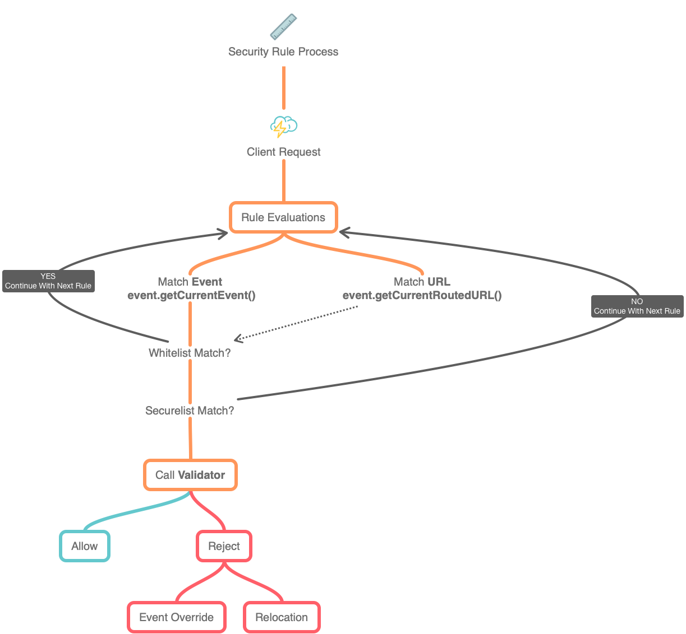

# Security Rules

We have seen by now that rules can be defined in disk, databases, or created at runtime.  These security rules all share a common anatomy and processing; let's explore it.

## Rule Anatomy

A `struct` models each rule with keys in it internally in CBSecurity.  So no matter where these rules come from, at the end of the day, they are registered as an array of structs internally.

```javascript
{
	"id"            : created automatically as a UUID,
	// A list of white list events or Uri's
	"whiteList"     : "", 
	// A list of secured list events or Uri's
	"secureList"    : "", 
	// Match the event or a url
	"match"         : "event", 
	// Attach a list of roles to the rule
	"roles"         : "", 
	// Attach a list of permissions to the 
	"permissions"   : "", rule
	// If rule breaks, and you have a redirect it will redirect here
	"redirect"      : "", 
	// If rule breaks, and you have an event, it will override it
	"overrideEvent" : "", 
	// Force SSL,
	"useSSL"        : false, 
	// The action to use (redirect|override|block) when no redirect or overrideEvent is defined in the rule.
	"action"        : "", 
	// metadata we can add so mark rules that come from modules
	"module"        : "", 
	// Match all HTTP methods or particular ones as a list
	"httpMethods"   : "*",
	// The rule only matches if the IP list matches. It can be a list of IPs to match. 
	"allowedIPs"    : "*" 
}
```

The only required key is the `secureList` which is what you are trying to secure. The rest are optional.


Please note that you can add as many extra keys as you like to your security rules structure, which can contain much more context and information for the validators to use for validation.  These are the ones we suggest you add and are used internally.



Please remember that by default, the secure and white lists are evaluated as regular expressions. You can turn that off in your [configuration settings.](../getting-started/configuration/)


### Rule Elements


| Property        | Type             | Default        |                                                                                 Description                                                                                |
| --------------- | ---------------- | -------------- | :------------------------------------------------------------------------------------------------------------------------------------------------------------------------: |
| `action`        | `string`         | _empty_        | The action to use (`redirect` or `override` or `block`) when no explicit `overrideEvent` or `redirect` elements are defined.  If not set, then we use the global settings. |
| `allowedIPs`    | `string`         | `*`            |                          The rule only matches if the IP list matches. It can be a list of IPs to match. By default, it matches all incoming IPs.                          |
| `httpMethods`   | `string`         | `*`            |                                        Match all HTTP methods or particular ones as a list. By default, it matches all HTTP Methods.                                       |
| `id`            | `uuid`           | `createUUID()` |                                         The internal ID of the rule.  We automatically assign a UUID to the rule upon registration.                                        |
| `match`         | `event` or `URL` |                |                              Determines if it needs to match the incoming URL or the incoming event. By default it matches the incoming event.                             |
| `module`        | `string`         | _empty_        |                                                  The name of the module this rule belongs to. Empty if none is discovered.                                                 |
| `overrideEvent` | `string`         |                |                                The event to override using ColdBox's `event.overrideEvent()` if the user if not authenticated or authorized                                |
| `permissions`   | `string`         |                |                                                  A comma delimited list of permissions that can access these secure events                                                 |
| `redirect`      | `string`         |                |                                                An event or route to redirect if the user is not authenticated or authorized                                                |
| `roles`         | `string`         |                |                                                     A comma delimited list of roles that can access these secure events                                                    |
| `securelist`    | `string`         |                |                                                        A comma delimited list of events or regex patterns to secure                                                        |
| `whitelist`     | `string`         |                |                       A comma delimited list of events or regex patterns to whitelist or to bypass security on if a match is made on the `secureList`                      |
| `useSSL`        | `boolean`        |                |                                                        If true, force SSL, else use whatever the request protocol is                                                       |

##

## Rules processing

When processing rules, it is essential to realize these rules are stored as an array that will be processed in **order**, so make sure your more specific rules will be processed **before** the more generic ones.



##

## Rule Overrides

As we saw from the overview and our configuration sections. We can declare the default actions for authorizations and authentication issues and to which events/URLs to go if that happens. There can be a time when you can override those global/module settings directly within a rule. Let's explore these overrides:

### Redirect

If you add a `redirect` element, then you will explicitly override the global/module setting, and if a match is made, a redirect will occur for the event registered.

```javascript
{
    "secureList" : "*",
    "redirect" : "mysecret.event"
}
```

### OverrideEvent

If you add an `overrideEvent` element, then you will explicitly override the global/module setting, and an event override will occur.

```javascript
{
    "secureList" : "*",
    "overrideEvent" : "main.onInvalidEvent"
}
```

### Action

If you add an `action` element, then you will be explicitly overriding the global/module setting, and the action will be based on this value (`override` or `event` or `block`)

```javascript
{
    "secureList" : "^api.*",
    "action" : "override"
}
```

## More on White Lists

If a rule has a white list, then it means that you can declare what are the **exceptions** to **ALLOW** if the incoming URL/event was matched against the `securedList`. This is a great way to say, hey, secure all but allow the following events:

```javascript
{
    "secureList" : ".*",
    "whitelist : "^login"
}
```


Please note: if a rule has a white list, it only applies to the **current** rule. So if the whitelist matches, it the current rule is skipped, and the process continues to the next rule.


Sometimes you want to make sure ALL events are secured, except for the ones specified, such as login events. If you add new functionality to your app it is easy to forget a new rule. To prevent unwanted access you could specify a LAST rule, which matches ALL event but NO permission at all. In that case you have to add a whitelist for all events which should still pass, for example:

```javascript
{
    "secureList" : ".*",
    "whitelist" : "login",
    "permissions" : "nonExistingPermission"
}
```
